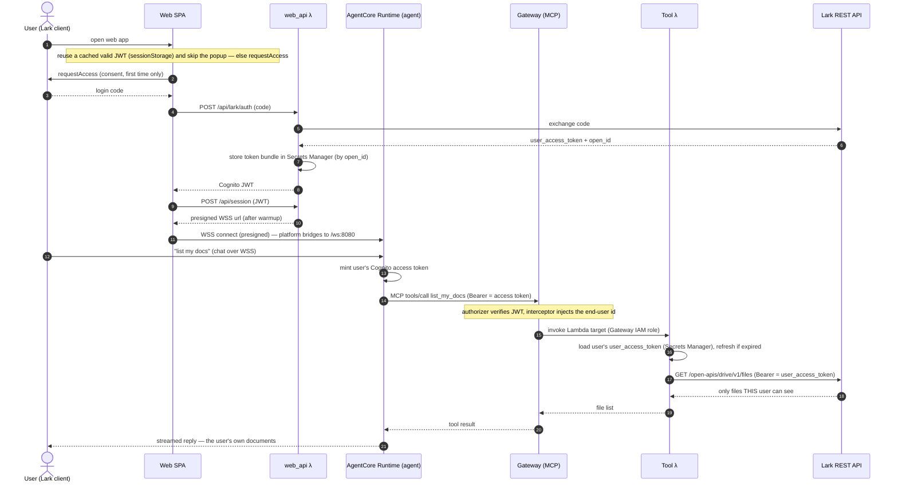

# Architecture

This is a reference implementation of **enterprise identity on Amazon Bedrock AgentCore, with Lark (Feishu) as the identity provider**. It demonstrates two things that are usually hard to get right: forwarding the *authenticated end-user identity* to downstream MCP tools, and inheriting that user's *actual permissions* so a tool can only reach what the user themselves can reach — the upstream system (Lark) adjudicates, we do not build a parallel access-control layer.

## The one idea

Every entrypoint resolves to the same stable identity `lark:{open_id}`, and that identity travels all the way to the tools — first as *who you are* (authentication), then as *what you can do* (authorization, via the user's own Lark token). The agent never holds a downstream credential.

## Components

| Component | What it is | Where |
|---|---|---|
| Router Lambda | Lark webhook ingestion (verify + AES decrypt, resolve user, invoke runtime) | `lambda/router/` |
| web_api Lambda | Lark login-code → Cognito JWT; session bootstrap (presigned WSS); stores the user's Lark token bundle | `lambda/web_api/` |
| Agent container | Strands agent on Bedrock; HTTP contract (8080) + WebSocket (/ws); AgentCore Memory for continuity; MCP client to the Gateway | `agent/` |
| AgentCore Gateway | An MCP server with a Cognito JWT authorizer + a Request Interceptor | created by `scripts/deploy.sh` (control-plane CLI) |
| Interceptor Lambda | Reads identity from the verified JWT, injects it (and a per-tenant downstream key) into the tool call | `lambda/interceptor/` |
| Tool Lambda | MCP tool targets behind the Gateway: `whoami` (identity proof) and `list_my_docs` (acts as the user against Lark) | `lambda/tools/` |
| Web SPA | Lark-embedded UI: h5sdk 免登 → JWT (cached in sessionStorage) → streaming chat over WSS | `web-ui/` |
| Cognito user pool | Token factory: mints a standard OIDC JWT for a Lark-authenticated user (Lark is not standard OIDC) | `stacks/security_stack.py` |
| AgentCore Memory | Per-user short-term memory (conversation history), keyed by `(actor_id, session)` | `lark_agent_agent_mem` (STM) |

## Two entrypoints, one identity

```
  Lark message  ────▶  Router Lambda ─┐        Lark desktop web UI ──▶ SPA (S3/CloudFront)
  (bot chat)           verify/decrypt  │          h5sdk requestAccess ─▶ login code
                       resolve user    │                                  │
                                       │                                  ▼
                                       │                        web_api Lambda
                                       │      POST /api/lark/auth  code ─▶ Cognito JWT (Lark is IdP)
                                       │                          + store user_access_token (Secrets Manager)
                                       │      POST /api/session    JWT  ─▶ presigned WSS URL
                                       │                                  │
             InvokeAgentRuntime (SigV4)│                                  │ browser opens WSS
             payload carries actorId   ▼                                  ▼ (platform bridges to /ws:8080)
                             ┌─────────────────────────────────────────────────────┐
                             │  Agent container (ARM64, AgentCore Runtime)          │
                             │    Strands agent + AgentCore Memory (per-user STM)   │
                             └───────────────────────┬─────────────────────────────┘
                                       │ MCP (streamable HTTP), Bearer = user's Cognito ACCESS token
                                       ▼
                             ┌───────────────────┐
                             │ AgentCore Gateway │  MCP server; customJWTAuthorizer (Cognito, allowedClients)
                             │  + Interceptor λ  │  passRequestHeaders=true; injects end-user identity into the call
                             └─────────┬─────────┘
                                       │ Gateway invokes its Lambda target (IAM role)
                                       ▼
                             ┌───────────────────┐
                             │   Tool Lambda     │  whoami / list_my_docs
                             │                   │  list_my_docs: load THIS user's Lark user_access_token
                             │                   │  (Secrets Manager, by open_id) + refresh if expired
                             └─────────┬─────────┘
                                       │ HTTPS, Authorization: Bearer <user_access_token>
                                       ▼
                                  Lark REST API (GET /open-apis/drive/v1/files)
                                  → returns only what THIS user can see. Lark adjudicates.
```

Both `lark:{open_id}` from the webhook and from the web UI are the same person, so session, memory, and the stored Lark token are shared across entrypoints.

## Why Lark is wrapped in Cognito

Lark is **not** a standard OIDC provider (no `id_token`, no discovery endpoint), so its login can't be plugged straight into an AgentCore/API-Gateway JWT authorizer. `web_api` performs a token exchange: Lark login code → Lark user info → Cognito `AdminCreateUser`/`AdminInitiateAuth` → a standard Cognito JWT (username = `lark:{open_id}`). Downstream, everything validates a normal Cognito JWT.

## The Gateway → Lark path (a common point of confusion)

The Gateway does **not** talk to Lark directly. Its target is a **Lambda**. The chain is:

```
agent  ──MCP──▶  AgentCore Gateway  ──invoke (IAM)──▶  Tool Lambda  ──HTTPS/Bearer──▶  Lark REST API
       (client)   (MCP server, ours)                   (list_my_docs)  (user_access_token)  (Feishu, not MCP)
```

Lark is a plain REST API at the bottom, not an MCP server. The Lambda target exists because "look up this user's token, refresh it if expired, then call Lark" is per-user logic that needs somewhere to run — an OpenAPI target pointed straight at Lark couldn't manage per-user tokens.

## Auth at every hop

| Hop | Credential | Who verifies |
|---|---|---|
| Lark webhook → Router | X-Lark-Signature + AES (encryptKey) | Router Lambda (fail-closed) |
| Browser → web_api `/api/session` | Cognito JWT | API Gateway JWT authorizer |
| Router / web_api → AgentCore Runtime | IAM SigV4 (`InvokeAgentRuntime`) | AgentCore |
| Browser → Runtime WSS | SigV4 **presigned URL** (signed by web_api) | AgentCore |
| Agent → Gateway (MCP) | user's Cognito **access** token (Bearer) | Gateway `customJWTAuthorizer` (validates `client_id` via `allowedClients`) |
| Gateway → Tool Lambda | Gateway IAM role | Lambda resource policy (principal `bedrock-agentcore`) |
| Tool Lambda → Lark REST | user's Lark **user_access_token** (Bearer) | Lark (scopes it to that user's own permissions) |

Note the deliberate split: the Runtime uses SigV4 inbound (so the webhook + web Lambdas can call it), while the *outbound* MCP path to the Gateway uses the per-user JWT. The Gateway needs the **access** token (it carries the `client_id` claim `allowedClients` checks); an ID token 403s with `insufficient_scope`.

## Identity pass-through vs permission inheritance

- **Identity pass-through** (authentication): the `whoami` tool reports `lark:{open_id}` + tenant, injected by the interceptor from the verified JWT. Proves the tool learns *who* is calling, while the agent holds no downstream key.
- **Permission inheritance** (authorization): `list_my_docs` acts *as* the user — it uses that user's Lark `user_access_token`, so Lark returns only the documents that user can see. Access is decided by Lark, not by our code. This is the stronger property: even a prompt-injected agent can only reach the user's own data, and only within the scopes the user consented to (`drive:drive`, `docx:document`).

## Conversation memory

The agent is a Strands agent with an `AgentCoreMemorySessionManager` (STM) keyed by `(actor_id, session)`, `session_id` derived from `actor_id` — one long thread per user. History persists across reconnects and both entrypoints (30-day retention), independent of the microVM. Per-session `(agent, MCP client)` are cached and reused across messages (rebuilding per message re-handshakes the Gateway and re-lists tools, ~15–20s of avoidable latency).

## Sequence: a web-UI turn that reads the user's docs



## Deploy shape

Six CDK stacks (security, agentcore, router, webui, gateway, observability). The AgentCore **Runtime** and **Gateway** have no CloudFormation resources in this region, so `scripts/deploy.sh` creates them out-of-band: the Runtime image is built ARM64 via the AgentCore CLI (CodeBuild), the Gateway + interceptor + tool targets via the control-plane CLI; their ids are fed back into `cdk.json`. See `README.md` for the deploy commands and Lark console setup, and `.dev/TIMEOUTS.md` (working notes) for the connection/timeout details.
